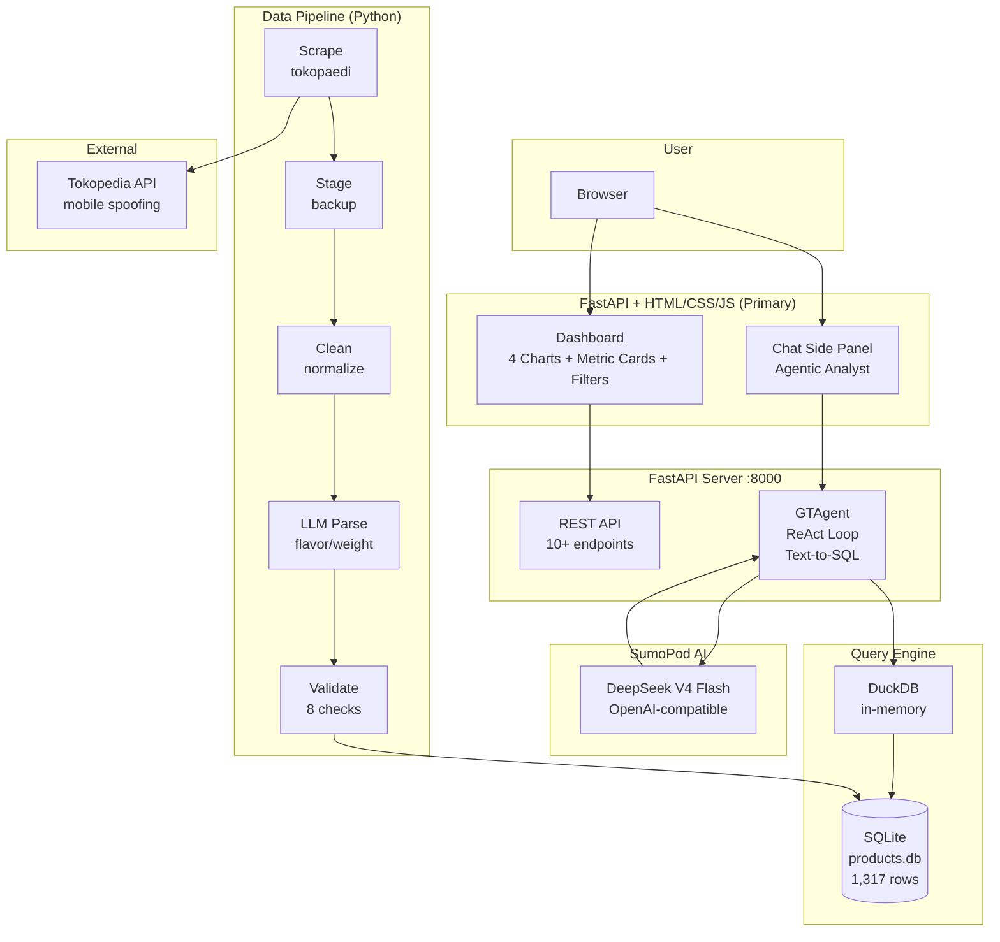
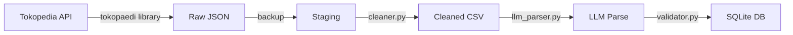
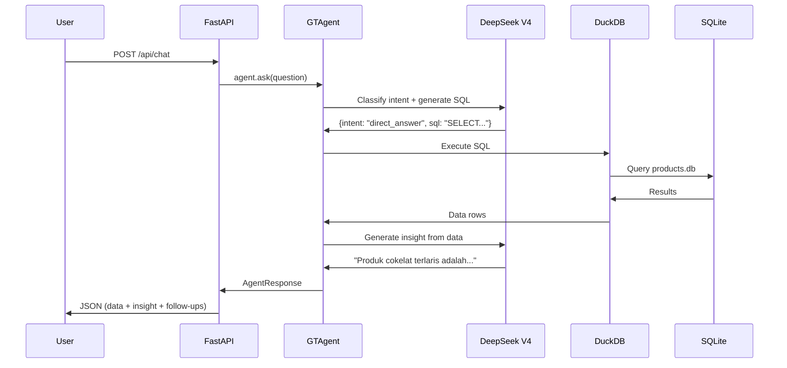

# ARCHITECTURE.md — GT Intelligence

> Technical architecture and design decisions for GT Intelligence.
> Last updated: Jun 22, 2026

---

## 1. Problem Statement

In general trade businesses, defining the right product to develop is difficult in the initial phase. Product type, specification, pricing, and variance are hard to determine without data. The data needed is scattered across marketplaces, not centralized, and difficult for non-technical people to collect.

**Solution:** GT Intelligence — an LLM-powered market intelligence system that scrapes product data from Indonesian marketplaces, analyzes trends and pricing patterns, and provides a natural-language interface for the business team to identify winning products.

**User persona:** Business team or product development team in a general trade business who wants to develop a product aimed at winning the market.

---

## 2. Architecture Diagram



---

## 3. Data Flow

### 3.1 Data Ingestion (Offline — 6 Steps)



1. **Scrape** — `tokopaedi` library spoofs mobile API to bypass Akamai bot protection. Searches by keyword, collects product data.
2. **Stage** — Raw JSON copied to staging as backup. If cleaning has a bug, re-run from staging without re-scraping.
3. **Clean** — Deduplicate by product_url, normalize prices, convert sold_count, parse specs, add category + province mapping.
4. **LLM Parse** — DeepSeek V4 Flash extracts flavor/weight/variant from product names (batch processing, ~$0.01 for 1,317 products).
5. **Validate** — 8 checks: schema, types, nulls, ranges, dedup, geography, category, row count. All must pass.
6. **Curate** — Write to SQLite with indexes on subcategory, province, and category.

### 3.2 Query Flow (Online — Agentic)



**Agentic capabilities:**
- Intent classification: direct_answer, needs_exploration, needs_clarification, chain_queries
- Auto-retry on SQL errors (max 3 iterations)
- Unanswerable detection (profit margin, buyer data, predictions)
- Follow-up question suggestions
- Dynamic session titles (auto-generated by LLM)

---

## 4. Dashboard

The dashboard loads on port 8000 with metric cards, 4 charts, and filters.

### Metric Cards
| Card | Query |
|------|-------|
| Total Produk | `COUNT(*)` |
| Subkategori Terlaris | `GROUP BY subcategory ORDER BY SUM(sold_count) DESC` |
| Total Toko | `COUNT(DISTINCT shop_name)` |
| Total Kota | `COUNT(DISTINCT shop_location)` |

### Charts
| # | Chart | Type | Data Source |
|---|-------|------|-------------|
| 1 | Demand per Subkategori | Bar chart | `SUM(sold_count) GROUP BY subcategory` |
| 2 | Distribusi Demand per Harga | Bar chart | Price buckets × total sold |
| 3 | Product Mapping — Demand vs Rating | Scatter quadrant | Per-product sold_count vs rating |
| 4 | Product Mapping — Demand vs Harga | Scatter quadrant | Per-product price vs sold_count |

### Filters
- **Subkategori:** chocolate, candy, snacks (multi-select)
- **Provinsi:** DKI Jakarta, Banten, Jawa Barat, Jawa Tengah, DI Yogyakarta, Jawa Timur (multi-select)
- **Kota/Kabupaten:** Dynamic based on selected province (multi-select)

### API Endpoints
| Endpoint | Method | Description |
|----------|--------|-------------|
| `/api/dashboard` | GET | Metrics + chart data (filtered) |
| `/api/dashboard/filters` | GET | Available filter options |
| `/api/dashboard/quadrant` | GET | Product mapping — demand vs rating |
| `/api/dashboard/revenue` | GET | Product mapping — price vs demand |
| `/api/chat` | POST | Agentic AI chat |
| `/api/sessions` | GET/POST | List/create chat sessions |
| `/api/sessions/{id}` | GET | Get session history |
| `/api/sessions/{id}/title` | PUT | Update session title |

### Analysis Categories

| Category | Dashboard | Chat Agent |
|----------|-----------|------------|
| 1. Demand & Trend | Subcategory demand bar chart, Customer Quality quadrant | "Produk terlaris?", "Tren per subkategori?" |
| 2. Profitability | Price × Demand quadrant, price distribution chart | "Estimasi pendapatan tertinggi?", "Harga rata-rata?" |
| 3. Geographic | Province/city filters | "Distribusi per kota?", "Kota mana paling banyak seller?" |
| 4. Temporal | Limited (snapshot data) | "Pola penjualan dari timestamp?", query by date range |
| 5. Product Success | Customer Quality quadrant (demand vs rating) | "Spesifikasi paling laris?", "Rasa/berat terlaris?" |

---

## 5. Technology Choices

| Layer | Tool | Why |
|-------|------|-----|
| Data scraping | Python + `tokopaedi` | Mobile API spoofing bypasses Akamai |
| Data storage | SQLite | File-based, zero setup, 1,317 rows, portable |
| Data processing | Pandas | Industry standard, easy to explain |
| Query engine | DuckDB | Fast in-memory SQL, ATTACH SQLite directly |
| LLM Agent | SumoPod DeepSeek V4 Flash | Free, OpenAI-compatible, 94%+ SQL accuracy on simple schemas |
| Interface | FastAPI + HTML/CSS/JS | Dashboard-first, smooth UX, full control |
| Visualization | Plotly | Interactive charts, scatter plots for quadrants |
| Containerization | Docker | Single container, simple deployment |
| Deployment | SumoPod VPS Jakarta | 2vCPU/2GB/40GB, Rp 60k/month, gt-intelligence.biz.id |

### Key Decision: Prompt Engineering vs Semantic Layer

Our schema is trivial — 1 table, 19 columns, no JOINs. We use **prompt engineering** with a structured system prompt (business context, data dictionary, SQL rules) instead of a semantic layer like WrenAI MDL.

TokenMix benchmark (2026): all LLMs score 94%+ on simple SQL. A semantic layer is overkill for this schema. If the schema grows to 10+ tables with JOINs, we'd adopt WrenAI MDL.

The system prompt contains:
- **Business context:** Indonesian term → SQL mapping (e.g., "terlaris" → ORDER BY sold_count DESC, "menguntungkan" → price × sold_count)
- **Data dictionary:** Column definitions, types, and semantics (e.g., sold_count = monthly sales, review_count = all zeros)
- **SQL rules:** SELECT-only, always use products table, ILIKE for text matching, handle NULLs for flavor/weight
- **Unanswerable rules:** Explicit list of out-of-scope topics (profit margins, buyer data, predictions, external data)
- **Dataset stats:** Row count, subcategories, location count, price range — injected dynamically at runtime

### Token Optimization

| Component | Strategy | Token Impact |
|-----------|----------|--------------|
| LLM parse step | Batch processing (10 products per API call), temperature=0 | ~$0.01 for 1,317 products |
| Query-time agent | Schema is 1 table/19 columns — minimal prompt tokens, no JOIN context needed | ~200 tokens for schema |
| Deterministic generation | temperature=0 for SQL, temperature=0.3 for insight generation | Consistent SQL, varied insights |
| Context window | System prompt ~500 tokens + schema ~200 tokens + data dictionary ~300 tokens | ~1,000 tokens per query |

---

## 6. Data Schema

```sql
CREATE TABLE products (
    -- Scraped fields
    timestamp TEXT,          -- When scraped (ISO datetime)
    shop_location TEXT,      -- Original city/kabupaten from Tokopedia
    product_name TEXT,       -- Full product title
    subcategory TEXT,        -- chocolate, candy, snacks
    price INTEGER,           -- Price in IDR
    rating REAL,             -- Average rating (0-5)
    sold_count INTEGER,      -- Monthly sales
    review_count INTEGER,    -- Number of reviews (all zero — API limitation)
    shop_name TEXT,          -- Seller name
    shop_rating REAL,        -- Seller rating (0 — API limitation)
    product_url TEXT,        -- Product link (unique, used for dedup)

    -- Derived fields (parsed from product_name by LLM)
    flavor TEXT,             -- e.g., "sapi panggang", "cokelat" (best-effort)
    weight TEXT,             -- e.g., "68g", "250ml" (best-effort)
    variant TEXT,            -- e.g., "large", "pack" (best-effort)

    -- Computed fields (added during cleaning)
    category TEXT,           -- "Makanan & Minuman"
    shop_city TEXT,          -- Normalized city name
    shop_province TEXT,      -- Province (mapped from city)
    price_bucket TEXT,       -- cheap (<15K) / mid (15K-75K) / expensive (>75K)
    rating_category TEXT     -- low (<3.5) / medium (3.5-4.5) / high (>=4.5)
);
```

**Indexes:** subcategory, shop_location, shop_province, category

---

## 7. Security & Privacy

| Risk | Mitigation |
|------|-----------|
| API keys exposed | .env file, never committed, gitignored |
| LLM hallucination | SQL grounding — LLM generates SQL, DuckDB executes it. Never free-form answers. |
| Unanswerable questions | Structured refusal with specific explanation |
| No PII in data | Public product listings only, no user data |
| VPS access | SSH key-based auth only, no passwords |

### AI Error Handling

| Scenario | Handling |
|----------|----------|
| **SQL auto-retry** | Max 3 iterations. If SQL fails, error message is fed back to LLM with the original question and failed SQL. LLM generates corrected SQL. |
| **Unanswerable detection** | LLM returns `is_unanswerable: true` with a reason. Agent displays structured refusal in Indonesian. |
| **Intent classification** | LLM classifies each question before acting — direct_answer, needs_exploration (discovery query first), needs_clarification (ask user to refine), chain_queries (multiple SQL for comparison). |
| **Hallucination mitigation** | LLM never generates free-form answers. It must generate SQL first. DuckDB executes the SQL. LLM interprets results. This two-step pattern prevents hallucinated data. |
| **Timeout/fallback** | If LLM API is unavailable, agent returns error message. If LLM returns malformed JSON, agent catches exception and returns error. |

---

## 8. MVP vs Production

| Concern | MVP (This Project) | Production (Future) |
|---------|-------------------|---------------------|
| Database | SQLite (file-based) | PostgreSQL (concurrent, millions of rows) |
| UI | FastAPI + custom HTML/CSS/JS | Full React/Next.js frontend |
| LLM | SumoPod DeepSeek V4 Flash | Self-hosted LLM or fine-tuned SLM |
| Scraping | Manual run, tokopaedi | Scheduled (cron → Airflow), proxy rotation, multi-marketplace |
| Auth | None (single user) | Multi-user, RBAC |
| Monitoring | Logs only | Prometheus + Grafana |
| Transformation | Python scripts | dbt (lineage, version control, auto-docs) |
| Cost | ~Rp 60k/month (VPS only) | VPS + DB + LLM API + monitoring costs |

---

## 9. Known Limitations

| Limitation | Impact | Mitigation |
|-----------|--------|-----------|
| Data snapshot (one point in time) | No real sales trends | Future: periodic scraping for time-series |
| Single marketplace (Tokopedia) | Shopee/Blibli blocked by Akamai | Documented; multi-marketplace is future improvement |
| No profit margin data | Revenue proxy (price × demand) only | Documented as limitation |
| review_count = 0 | No engagement signal | Rating used as alternative quality signal |
| Product spec parsing ~60% accuracy | Some flavor/weight/variant fields null | Documented as best-effort extraction |
| Seller location, not buyer | Geographic proxy only | Documented |

---

## 10. Future Improvements

1. **Multi-marketplace scraping** (Shopee, Bukalapak with residential proxy)
2. **Time-series data** (weekly scraping for real trend analysis)
3. **Profit margin estimation** (with cost data input from business team)
4. **Fine-tuned SLM** (Qwen3-6B for SQL generation)
5. **dbt transformation layer** (lineage tracking, version control)
6. **Multi-user auth + RBAC**
