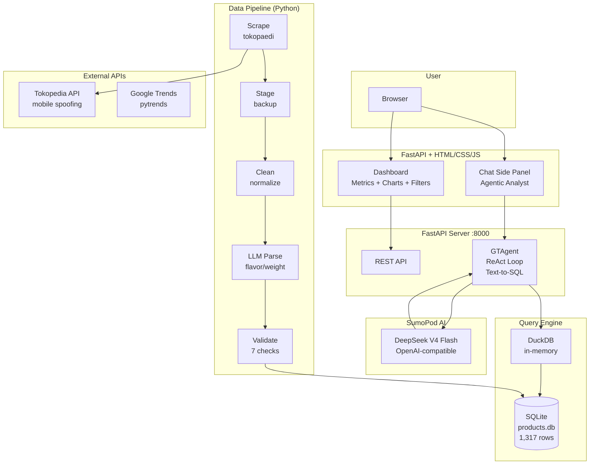
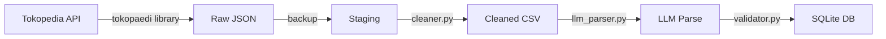
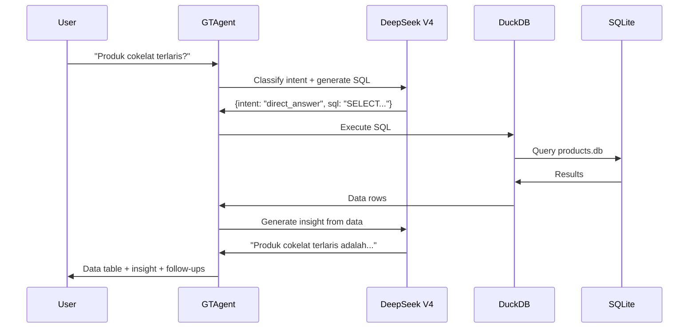

# ARCHITECTURE.md — GT Intelligence

> Technical architecture and design decisions for GT Intelligence.
> Last updated: Jun 22, 2026

---

## 1. Problem Statement

In general trade businesses, defining the right product to develop is difficult in the initial phase. Product type, specification, pricing, and variance are hard to determine without data. The data needed is scattered across marketplaces, not centralized, and difficult for non-technical people to collect.

**Solution:** GT Intelligence — an LLM-powered market intelligence system that scrapes product data from Indonesian marketplaces, analyzes trends and pricing patterns, and provides a natural-language interface for the business team to identify winning products.

**User persona:** Business team or product development team in a general trade business who wants to develop a product aimed at winning the market.

---

## 2. Architecture Diagram



---

## 3. Data Flow

### 3.1 Data Ingestion (Offline — 6 Steps)



1. **Scrape** — `tokopaedi` library spoofs mobile API to bypass Akamai bot protection. Searches by keyword, collects product data.
2. **Stage** — Raw JSON copied to staging as backup. If cleaning has a bug, re-run from staging without re-scraping.
3. **Clean** — Deduplicate by product_url, normalize prices, convert sold_count, parse specs, add category + province mapping.
4. **LLM Parse** — DeepSeek V4 Flash extracts flavor/weight/variant from product names (batch processing, ~$0.01).
5. **Validate** — 7 checks: schema, types, nulls, ranges, dedup, geography, row count. All must pass.
6. **Curate** — Write to SQLite with indexes on subcategory and province.

### 3.2 Query Flow (Online — Agentic)



**Agentic capabilities:**
- Intent classification: direct_answer, needs_exploration, needs_clarification, chain_queries
- Auto-retry on SQL errors (max 3 iterations)
- Unanswerable detection (profit margin, buyer data, predictions)

---

## 4. Technology Choices

| Layer | Tool | Why |
|-------|------|-----|
| Data scraping | Python + `tokopaedi` | Mobile API spoofing bypasses Akamai |
| Data storage | SQLite | File-based, zero setup, 1,317 rows, portable |
| Data processing | Pandas | Industry standard, easy to explain |
| LLM Agent | SumoPod DeepSeek V4 Flash | Free, OpenAI-compatible, 94%+ SQL accuracy on simple schemas |
| Interface | FastAPI + HTML/CSS/JS | Dashboard-first, smooth UX, full control |
| Visualization | Plotly | Interactive charts, scatter plots for quadrants |
| Containerization | Docker | Single container, simple deployment |
| Deployment | SumoPod VPS Jakarta | 2vCPU/2GB/40GB, Rp 60k/month |

### Key Decision: Prompt Engineering vs Semantic Layer

Our schema is trivial — 1 table, 19 columns, no JOINs. We use **prompt engineering** with a structured system prompt (business context, data dictionary, SQL rules) instead of a semantic layer like WrenAI MDL.

TokenMix benchmark (2026): all LLMs score 94%+ on simple SQL. A semantic layer is overkill for this schema. If the schema grows to 10+ tables with JOINs, we'd adopt WrenAI MDL.

---

## 5. Data Schema

```sql
CREATE TABLE products (
    timestamp TEXT,          -- When scraped
    shop_location TEXT,      -- City/Kabupaten (original)
    shop_city TEXT,          -- Normalized city name
    shop_province TEXT,      -- Province (mapped from city)
    product_name TEXT,       -- Full product title
    category TEXT,           -- e.g., "Makanan & Minuman"
    subcategory TEXT,        -- chocolate, candy, snacks
    price INTEGER,           -- Price in IDR
    rating REAL,             -- Average rating (0-5)
    sold_count INTEGER,      -- Monthly sales
    review_count INTEGER,    -- Number of reviews (all zero — API limitation)
    shop_name TEXT,          -- Seller name
    shop_rating REAL,        -- Seller rating (0 — API limitation)
    product_url TEXT,        -- Product link (unique)
    flavor TEXT,             -- Parsed from product_name (best-effort)
    weight TEXT,             -- Parsed from product_name (best-effort)
    variant TEXT,            -- Parsed from product_name (best-effort)
    price_bucket TEXT,       -- Computed: cheap/mid/expensive
    rating_category TEXT     -- Computed: low/medium/high
);
```

---

## 6. Security & Privacy

| Risk | Mitigation |
|------|-----------|
| API keys exposed | .env file, never committed, gitignored |
| LLM hallucination | SQL grounding — LLM generates SQL, DuckDB executes it. Never free-form answers. |
| Unanswerable questions | Structured refusal with specific explanation |
| No PII in data | Public product listings only, no user data |
| VPS access | SSH key-based auth only, no passwords |

---

## 7. MVP vs Production

| Concern | MVP (This Project) | Production (Future) |
|---------|-------------------|---------------------|
| Database | SQLite (file-based) | PostgreSQL (concurrent, millions of rows) |
| UI | FastAPI + custom HTML/CSS/JS | Full React/Next.js frontend |
| LLM | SumoPod DeepSeek V4 Flash | Self-hosted LLM or fine-tuned SLM |
| Scraping | Manual run, tokopaedi | Scheduled (cron → Airflow), proxy rotation, multi-marketplace |
| Auth | None (single user) | Multi-user, RBAC |
| Monitoring | Logs only | Prometheus + Grafana |
| Transformation | Python scripts | dbt (lineage, version control, auto-docs) |
| Cost | ~Rp 60k/month (VPS only) | VPS + DB + LLM API + monitoring costs |

---

## 8. Known Limitations

| Limitation | Impact | Mitigation |
|-----------|--------|-----------|
| Data snapshot (one point in time) | No real sales trends | Future: periodic scraping for time-series |
| Single marketplace (Tokopedia) | Shopee/Blibli blocked by Akamai | Documented; multi-marketplace is future improvement |
| No profit margin data | Revenue proxy (price × demand) only | Documented as limitation |
| review_count = 0 | No engagement signal | Rating used as alternative quality signal |
| Product spec parsing ~60% accuracy | Some flavor/weight/variant fields null | Documented as best-effort extraction |
| Seller location, not buyer | Geographic proxy only | Documented |

---

## 9. Future Improvements

1. **Multi-marketplace scraping** (Shopee, Bukalapak with residential proxy)
2. **Time-series data** (weekly scraping for real trend analysis)
3. **Profit margin estimation** (with cost data input from business team)
4. **Geographic visualization** (scatter_mapbox with city coordinates)
5. **Product spec table** (top flavors/weights per subcategory)
6. **Fine-tuned SLM** (Qwen3-6B for SQL generation)
7. **dbt transformation layer** (lineage tracking, version control)
8. **Multi-user auth + RBAC**
